# AI DCF Analyst Coworker

[Live demo](https://ai-dcf-analyst-coworker.vercel.app/) · [GitHub repo](https://github.com/Austin-Li7/dcf-analyst-coworker)


AI DCF Analyst Coworker is a source-grounded investment research workflow that helps an investor turn public-company data into reviewable DCF valuation artifacts. Instead of asking an LLM for a one-shot valuation, the app breaks the work into typed steps: source ingestion, structured AI drafts, human review checkpoints, forecast assembly, WACC, and a final valuation dashboard.

The project is built as a portfolio-grade prototype: the deployed app is interactive, the prompt system is versioned, the LLM outputs are parsed into Zod-validated machine artifacts, and the financial logic is covered by automated tests.

## What It Does

1. A user enters a ticker or company name.
2. The app fetches public SEC Company Facts and latest 10-K evidence at runtime.
3. The selected LLM drafts a structured company architecture, competitive landscape, synergy map, and forecast package.
4. Each AI artifact goes through an explicit review gate before it can feed downstream steps.
5. The app combines approved forecasts with market data and WACC assumptions to produce a DCF valuation view with audit flags.

The live demo can be opened directly in a browser. LLM-backed steps require a Claude, Gemini, or OpenAI key through the settings modal or server environment variables; the public SEC bootstrap endpoint can be tested without an LLM key.

```text
https://ai-dcf-analyst-coworker.vercel.app/api/bootstrap-company?query=AAPL
```

## Why This Exists

One-shot AI valuation is fragile. It can skip source checks, bury weak assumptions, and turn uncertain claims into confident prose. This project takes a coworker approach: the AI drafts and organizes the analysis, while the investor reviews sources, edits assumptions, and keeps final judgment.

The core pattern is:

- narrow prompt contracts for each analytical step
- structured machine artifacts instead of raw chat transcripts
- Zod validation before artifacts enter the app state
- human review checkpoints before downstream handoff
- explicit valuation assumptions, WACC inputs, and audit notes

## Product Workflow

| Step | User-facing module | What the system produces |
| --- | --- | --- |
| 1 | Company Profile | SEC-grounded business architecture and review matrix |
| 2 | Historical Financials | Five-year historical baseline from SEC/Yahoo/manual inputs |
| 3 | Competitive Landscape | Porter-style competitive forces with source links |
| 4 | Synergies & Drivers | Capability paths, flywheel logic, and capital allocation signals |
| 5 | Forecast | Structured segment forecast with assumption IDs and confidence flags |
| 6 | Executive Summary | Aggregated forecast summary and review notes |
| 7 | WACC Calculator | Market-data-backed discount-rate inputs |
| 8 | DCF Valuation | Intrinsic value, market bridge, sensitivity controls, and audit flags |

## Architecture

```mermaid
flowchart LR
  Ticker["Ticker / company query"] --> PublicData["SEC EDGAR + Yahoo Finance"]
  PublicData --> SourceManifest["Source manifest + baseline package"]
  SourceManifest --> PromptContracts["v5.5 prompt contracts"]
  PromptContracts --> LLM["Claude / Gemini / OpenAI"]
  LLM --> Schemas["Zod structured artifacts"]
  Schemas --> ReviewUI["Human review gates"]
  ReviewUI --> Forecast["Forecast + WACC handoff"]
  Forecast --> Valuation["DCF dashboard + audit trail"]
```



Key implementation pieces:

- `dcf-cfp-module/src/app/api/` contains the Next.js API routes for SEC bootstrap, LLM analysis, forecast generation, revision, WACC data, and export flows.
- `dcf-cfp-module/src/lib/*-schema.ts` defines typed contracts for the structured artifacts.
- `dcf-cfp-module/src/lib/dcf-valuation.ts` converts approved forecast and WACC inputs into enterprise value, equity value, implied upside, and assumption audit flags.
- `v5.5_DCF/` contains the final prompt workflow specification used as the analytical source of truth.

## Tech Stack

- **Frontend:** Next.js 16, React 19, TypeScript, Tailwind CSS
- **AI providers:** Anthropic Claude, Google Gemini, OpenAI
- **Data:** SEC EDGAR Company Facts, latest 10-K HTML evidence, Yahoo Finance market data
- **Validation:** Zod schemas, provider-safe JSON schema generation
- **Testing:** Node test runner with schema, ingestion, forecast, WACC, and valuation tests
- **Deployment:** Vercel, with the app rooted at `dcf-cfp-module/`

## My Contribution

This was built as an AI-assisted product prototype. Coding agents helped implement the visual workflow and UI, while I designed the valuation workflow, prompt architecture, review gates, and artifact contracts.

My main contributions were:

- designed the v5.5 DCF prompt architecture and step boundaries
- defined the structured artifact pattern: `machine_artifact`, `reviewer_summary`, and `ui_handoff`
- specified source-grounding, review checkpoints, and downstream handoff behavior
- integrated schema validation, API route behavior, and valuation logic into a runnable app
- tested the prompt system and valuation pipeline against public-company examples
- curated the repo into a publishable portfolio artifact with sanitized fixtures

The project should be read as an AI-assisted investment research coworker and workflow prototype, not as financial advice and not as a claim that every UI component was manually authored from scratch.

## Running Locally

```bash
cd dcf-cfp-module
npm ci
npm run dev
```

Open `http://localhost:3000`.

Create `dcf-cfp-module/.env.local` when using server-side keys:

```bash
SEC_USER_AGENT="Your Name your.email@example.com"
ANTHROPIC_API_KEY=""
GEMINI_API_KEY=""
OPENAI_API_KEY=""
```

Keys can also be entered through the in-app settings modal. Browser-entered keys stay in local storage and are not committed to the repository.

## Verification

```bash
cd dcf-cfp-module
npm test
npm run lint
npm run build
```

Current local verification:

- `npm test`: 81 tests passing
- `npm run lint`: passing
- `npm run build`: passing
- deployed homepage: `200 OK`
- deployed SEC bootstrap API: returns a structured AAPL SEC package

## Repository Layout

```text
.
├── dcf-cfp-module/              # Next.js app, API routes, schemas, tests
├── v5.5_DCF/                    # Versioned prompt workflow specification
├── DEPLOYMENT.md                # Vercel setup notes
└── IMPLEMENTATION_FLOW.md       # Development/workflow notes
```

## Current Limitations

- LLM-backed steps require user-provided or server-provided API keys.
- The portfolio version avoids committing raw filings, spreadsheets, or proprietary handoff material.
- The app is a research workflow prototype, not a production investment-advice system.
- A fixture-driven no-key demo mode would make the public demo easier for recruiters to evaluate.

## Deployment

Deploy the app from the `dcf-cfp-module/` subdirectory on Vercel.

Required settings:

- root directory: `dcf-cfp-module`
- install command: `npm install`
- build command: `npm run build`
- optional server-side environment variables: `ANTHROPIC_API_KEY`, `GEMINI_API_KEY`, `OPENAI_API_KEY`
- recommended environment variable for SEC requests: `SEC_USER_AGENT`

See [DEPLOYMENT.md](DEPLOYMENT.md) for detailed setup.
